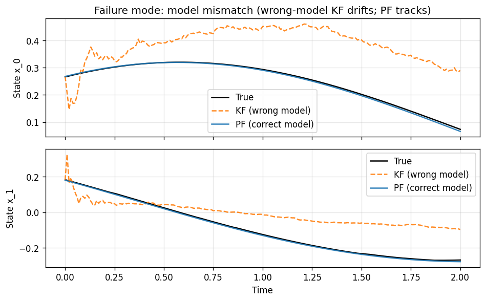
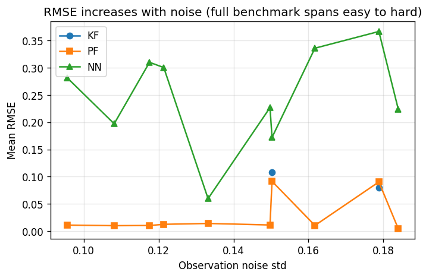

# Latent State Inference Benchmark — Pilot Pack

**Synthetic time-series with known ground-truth latent state** for evaluating inference algorithms under partial observability, noise, delay, and regime changes.

---

## Why This Benchmark?

Across **quantitative finance**, **industrial monitoring**, and **risk modeling**, teams deploy ML to infer unobservable variables—risk, volatility, system health, operational state. In real deployments the true latent state is never known, so models can be **confidently wrong** without detection. Existing benchmarks focus on prediction accuracy, not inference robustness or failure detection.

This benchmark fills the gap: **synthetic data with known latent states and regimes**, so you can measure inference error, regime detection, and failure modes under controlled conditions.

---

## What the Pilot Pack Contains

| Item | Description |
|------|-------------|
| **10 sequences** | 200 steps each; CSV time-series + per-sequence metadata |
| **Ground truth** | Hidden state (`x_0`, `x_1`, …) and **regime** labels (STABLE, GRADUAL_DRIFT, ABRUPT_JUMP, TRANSIENT_SHOCK) for evaluation |
| **Baseline metrics** | RMSE and uncertainty metrics for Kalman filter, EKF, particle filter, and a simple NN |
| **Reproducibility** | Seeds and full config in `metadata/`; `PACK_MANIFEST.json` records the exact generation command |

### Contents at a Glance

| Path | Description |
|------|-------------|
| [data/](data/) | One CSV per sequence: `seq_XXXXXX_data.csv` (time, observations, latent state, regime) |
| [metadata/](metadata/) | One JSON per sequence: config and seeds for reproducibility |
| [metrics_summary.csv](metrics_summary.csv) | One row per sequence: baseline metrics (KF, EKF, PF, NN) and conditions |
| [PACK_MANIFEST.json](PACK_MANIFEST.json) | Pack-level command, schema, and generated timestamp |
| [plots/](plots/) | Illustrative figures: trajectory, noise escalation, failure modes |

---

## What the Pilot Demonstrates

1. **Ground truth matters** — Measure latent-state error and regime-detection delay directly.
2. **Baselines can fail** — The [plots](plots/) show:
   - **Model mismatch:** Wrong-model Kalman filter drifts; particle filter (correct model) tracks.
   - **Shock-event miss:** Shock-blind models miss abrupt jumps and volatility spikes.
   - **Overconfident uncertainty:** KF bands can miss the true state; the benchmark exposes false confidence.
3. **Noise and difficulty** — Performance degrades as observation noise increases; the full benchmark spans easy to hard for systematic evaluation.
4. **Reproducibility** — Every run has seeds and config; the pack can be regenerated at scale for papers and product validation.

---

## Evaluation Metrics (Included)

- **Latent state estimation error** (e.g. RMSE vs ground truth)
- **Regime change detection delay**
- **False confidence rate** (when uncertainty bands miss the truth)
- **Calibration error**
- **Failure under noise escalation**

See [metrics_summary.csv](metrics_summary.csv) for baseline results per sequence and [README.md](README.md) for column definitions.

---

## Example: Why the full benchmark matters

The pilot plots show exactly the failure modes the full benchmark is designed to stress-test. With ground truth, you can see when and why standard methods break—and validate that your method does better.

**Model mismatch:** A wrong-model Kalman filter drifts away from the true state while a particle filter (correct model) tracks it. The full benchmark lets you systematically test robustness to model mismatch across many regimes and noise levels.

**Noise escalation:** Performance degrades as observation noise increases. The pilot gives a taste; the full benchmark spans easy to hard so you can report curves and compare methods at scale.

**More in the [plots/](plots/) folder:** false confidence (KF bands missing the truth), shock-event miss (models blind to abrupt jumps), and an example latent-vs-observed trajectory. The full benchmark provides hundreds of such scenarios for rigorous evaluation and papers.

---

## Data Format (Quick Reference)

Each `data/seq_XXXXXX_data.csv` has:

- **time** — Simulation time (step = `dt` in metadata).
- **obs_0**, **obs_1** (if present) — Noisy observations; may contain `nan` where missing or delayed.
- **x_0**, **x_1**, … — **Ground-truth latent state** (for evaluation only; treat as hidden when benchmarking).
- **regime** — Per-step label: `0` = STABLE, `1` = GRADUAL_DRIFT, `2` = ABRUPT_JUMP, `3` = TRANSIENT_SHOCK.

---

## Pilot vs Full Benchmark

| | Pilot (this pack) | Full benchmark |
|--|-------------------|----------------|
| **Sequences** | 10 | 1000+ |
| **Steps/sequence** | 200 | 1000–2000 |
| **State dimension** | 2 | 2–5 |
| **Dynamics** | LinearSDE, DampedOscillator | + Regime-aware SDE, full sweep |
| **Noise / missing / delay** | Limited range | 0.01–0.5 noise, 0–20% missing, 0–5 step delay |
| **Use case** | Try the format, see metrics & failure modes | Rigorous evaluation, papers, product validation |

The **full benchmark** is available as a licensed product. Contact the maintainers for access.

---

## Citation & License

If you use this benchmark in research or products, please cite the repository and/or the benchmark specification. See the project repository for license terms.

---

*Part of the [Latent State Inference Benchmark](../) for industry and finance ML.*
